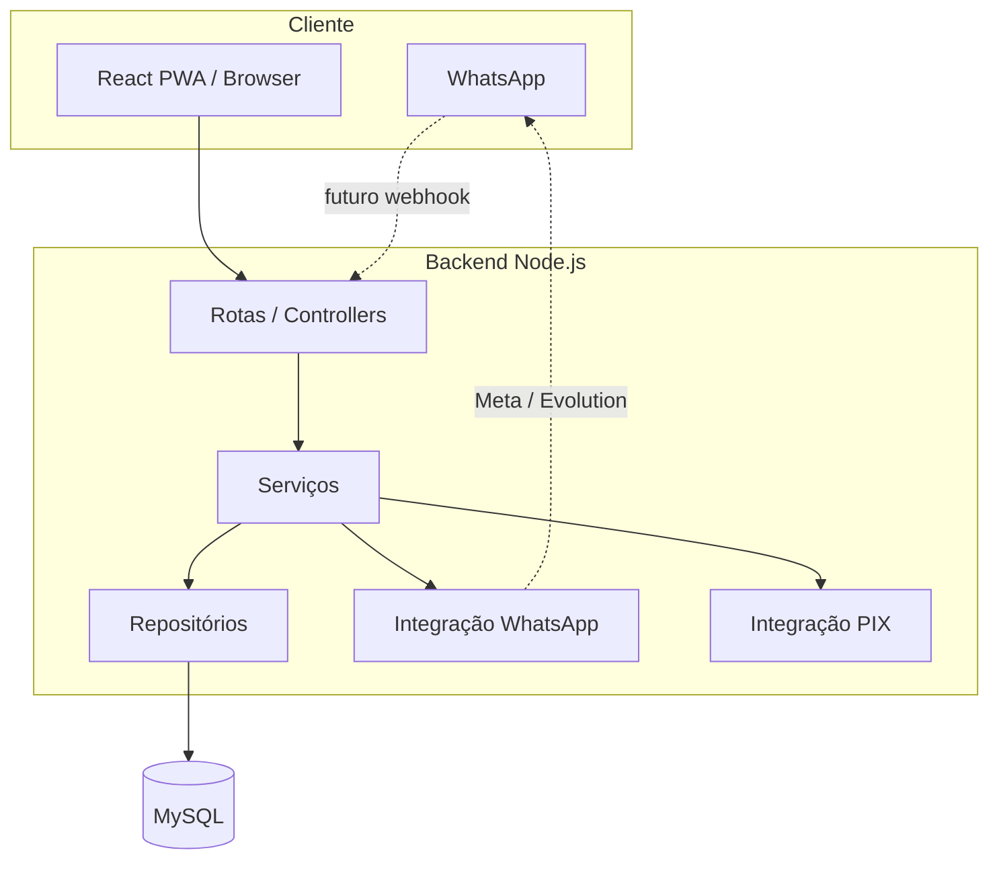
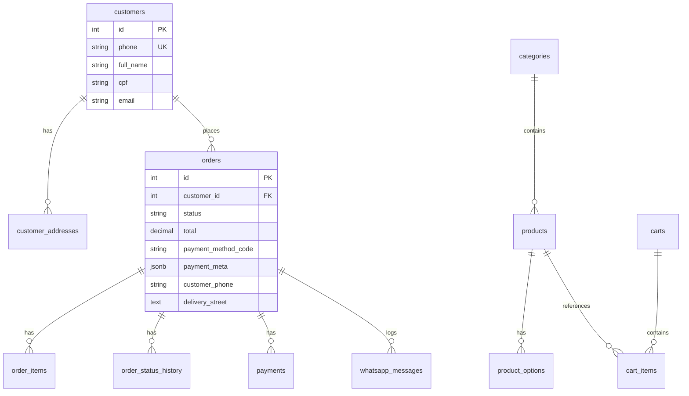
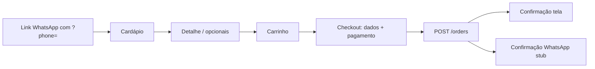

# Delivery + Cardápio digital + WhatsApp — Arquitetura (MVP)

Solução monorepo em `app_loja`: **React (Vite)** no frontend, **Node.js (Express)** no backend, **MySQL** no banco. Integrações **WhatsApp** e **PIX** estão em provedores trocáveis (stub no MVP).

---

## 1. Visão da arquitetura



### Camadas (backend)

| Camada        | Pasta / responsabilidade |
|---------------|---------------------------|
| Rotas + HTTP  | `backend/src/app.js`, `controllers/` |
| Regras de uso | `services/` |
| SQL           | `repositories/` |
| Integrações   | `integrations/whatsapp`, `integrations/pix` |
| Middlewares   | `middlewares/` (auth admin, erros) |

---

## 2. Modelo de dados (MySQL)



**Arquivo:** `database/migrations/001_initial_schema.sql`

**Índices:** `customers(phone)`, `customers(cpf)` parcial, `orders(customer_id)`, `orders(status)`, `orders(created_at DESC)`, `whatsapp_messages(to_phone)`.

**SEFAZ MT (preparação):** snapshot em `orders` de nome, CPF, e-mail, telefone e endereço completo no momento do pedido; itens com preço e nome congelados em `order_items`.

---

## 3. Fluxo do usuário (cliente)



**Regras de negócio (MVP implementadas):**

- Telefone normalizado (dígitos, DDD) é chave de identificação.
- Primeiro pedido exige nome, CPF, e-mail, endereço completo; dados persistidos em `customers` / `customer_addresses`.
- Pedidos seguintes reutilizam e permitem edição no checkout (upsert do endereço padrão).
- Carrinho vazio não finaliza.
- Produto indisponível bloqueia finalização.
- Dinheiro: exige `changeNeeded` (boolean); se `true`, exige `changeForAmount` &gt; 0.
- Status: `received` → `preparing` → `out_for_delivery` → `delivered` ou `cancelled`.

---

## 4. Fluxo conversacional WhatsApp (especificação + API)

Mensagens sugeridas (templates configuráveis em `store_settings`):

1. **Saudação** + opções: Ver cardápio | Fazer pedido | Ver status | Atendente.
2. **Ver cardápio** → `POST /whatsapp/send-menu-link` com `{ "phone": "11999990000" }` envia texto com URL `PUBLIC_MENU_URL/?phone=...`.
3. **Pedido** → cliente usa o site; ao concluir, `POST /orders` dispara confirmação automática.
4. **Status** → operador atualiza no painel; `PATCH /admin/orders/:id/status` pode notificar via `sendStatusUpdate` (opcional `notify: false`).

**Provedores:** `WHATSAPP_PROVIDER=stub` (log + tabela `whatsapp_messages`) ou `meta` (esqueleto HTTP Graph API em `integrations/whatsapp/metaProvider.js`).

---

## 5. Wireframes (descrição das telas)

| Tela            | Conteúdo principal |
|-----------------|--------------------|
| Home / cardápio | Lista por categoria, foto, preço, link para detalhe |
| Detalhe produto | Descrição, opcionais (checkbox), observação, quantidade, subtotal |
| Carrinho        | Itens, +/- qty, remover, subtotal + taxa + total |
| Checkout        | OTP no celular, sessão JWT, dados (pré-preenchidos), endereço, pagamento |
| Confirmação     | Nº pedido, total, itens, PIX copia-e-cola se `pix_online` |
| Admin login     | JWT |
| Admin painel    | Pedidos (mudança de status), produtos (ativo/inativo), taxa e templates |

---

## 6. Endpoints da API (resumo)

| Método | Rota | Auth |
|--------|------|------|
| GET | `/health` | — |
| GET | `/settings/public` | — |
| GET | `/categories` | — |
| GET | `/products` | — |
| GET | `/products/:id` | — |
| POST | `/auth/client/request-code` | — (rate limit) |
| POST | `/auth/client/verify-code` | — (rate limit) |
| GET | `/customers/me` | Cliente JWT (`Authorization: Bearer`) |
| POST | `/customers/me` | Cliente JWT |
| PUT | `/customers/me` | Cliente JWT |
| POST | `/customers/me/addresses` | Cliente JWT |
| PUT | `/addresses/:id` | Cliente JWT (endereço do próprio cliente) |
| POST | `/cart` | — → retorna `{ id, accessToken }` |
| GET | `/cart/me` | `X-Cart-Token` (JWT do carrinho) |
| POST | `/cart/items` | `X-Cart-Token` |
| PUT | `/cart/items/:id` | `X-Cart-Token` |
| DELETE | `/cart/items/:id` | `X-Cart-Token` |
| POST | `/orders` | Cliente JWT + `X-Cart-Token` |
| GET | `/orders/me` | Cliente JWT |
| GET | `/orders/:id` | Cliente JWT (só se o pedido for do telefone da sessão) |
| PATCH | `/orders/:id/status` | Admin JWT |
| POST | `/payments/*` | Header `X-Internal-Key` (= `INTERNAL_API_KEY`) |
| POST | `/whatsapp/*` | Header `X-Internal-Key` |
| POST | `/admin/login` | — (rate limit) |
| GET | `/admin/orders` | JWT |
| GET | `/admin/customers` | JWT |
| GET | `/admin/products` | JWT |
| POST | `/admin/products` | JWT |
| PUT | `/admin/products/:id` | JWT |
| PATCH | `/admin/products/:id/availability` | JWT |
| DELETE | `/admin/products/:id` | JWT |
| PATCH | `/admin/orders/:id/status` | JWT |
| GET/PUT | `/admin/settings` | JWT |
| GET | `/admin/categories` | JWT |

**Importante:** `GET /orders/me` deve ser registrado **antes** de `GET /orders/:id` no Express.

**Segurança:** CORS restrito por `CORS_ORIGINS` (ou padrão localhost). Rate limit global e nos fluxos de OTP/login/pedido. Chamadas HTTP a WhatsApp/PIX exigem `INTERNAL_API_KEY` (uso por jobs internos ou ferramentas com a chave — não pelo app do cliente).

---

## 7. Estrutura de pastas

```
app_loja/
├── docker-compose.yml
├── database/migrations/001_initial_schema.sql
├── ARCHITECTURE.md
├── backend/
│   ├── package.json
│   ├── .env.example
│   ├── scripts/migrate.js, seed.js
│   └── src/
│       ├── server.js, app.js
│       ├── config/, controllers/, middlewares/
│       ├── repositories/, services/
│       └── integrations/whatsapp, integrations/pix
└── frontend/
    ├── package.json, vite.config.js, index.html
    └── src/
        ├── main.jsx, App.jsx
        ├── api/client.js
        ├── context/CartContext.jsx
        ├── components/Layout.jsx
        ├── pages/
        └── styles/global.css
```

---

## 8. Exemplos de payloads

### Criar carrinho

`POST /cart` → `{}`  
Resposta: `{ "id": "uuid", "accessToken": "<jwt>" }` — guardar `accessToken` e enviar em `X-Cart-Token` nas rotas do carrinho.

### Item no carrinho

Header: `X-Cart-Token: <jwt do carrinho>`

```json
POST /cart/items
{
  "productId": 1,
  "quantity": 2,
  "note": "Sem cebola",
  "optionIds": [1]
}
```

### Finalizar pedido

Headers: `Authorization: Bearer <jwt cliente>` (após OTP) e `X-Cart-Token: <jwt carrinho>`

```json
POST /orders
{
  "paymentMethodCode": "cash",
  "paymentMeta": { "changeNeeded": true, "changeForAmount": 100 },
  "customer": {
    "fullName": "Maria Silva",
    "cpf": "12345678901",
    "email": "maria@email.com"
  },
  "address": {
    "street": "Av. Brasil",
    "number": "1000",
    "neighborhood": "Centro",
    "zipCode": "78000000",
    "complement": "Apto 12",
    "reference": "Próximo à praça"
  }
}
```

### PIX online (após pedido)

O MVP já cria linha em `payments` ao escolher `pix_online`. Para gerar cobrança avulsa via HTTP (uso interno): header `X-Internal-Key`.

```json
POST /payments/pix
{ "orderId": 1 }
```

### Admin login

```json
POST /admin/login
{ "email": "admin@delivery.local", "password": "admin123" }
```

---

## 9. Estratégia PIX (futuro)

- Manter interface em `integrations/pix/` com método `createCharge({ orderId, amount, customer })`.
- Implementar provedor real (ex.: EFI, Mercado Pago, Stone) retornando `copyPaste`, QR, `expiresAt`, `providerRef`.
- Webhook de confirmação atualiza `payments.status` para `paid` e opcionalmente notifica WhatsApp.
- **MVP:** `pixStubProvider` gera payload fictício e grava em `payments.meta`.

---

## 10. Estratégia WhatsApp (futuro)

1. Definir `WHATSAPP_PROVIDER=meta` e preencher token + `PHONE_NUMBER_ID`.
2. Implementar fila (BullMQ / SQS) se volume crescer; hoje envio é síncrono.
3. Webhook `POST` (Meta) para inbound: parser de texto/botões → respostas do fluxo (cardápio, status).
4. Templates HSM para fora da janela de 24h (política Meta).
5. Todos os envios continuam logados em `whatsapp_messages`.

---

## 11. Como executar (desenvolvimento)

```bash
cd app_loja
docker compose up -d
cd backend
cp .env.example .env
npm run migrate
npm run seed
npm run dev
```

Outro terminal:

```bash
cd frontend
npm run dev
```

- API: `http://localhost:4000`
- App: `http://localhost:5173` (proxy `/api` → API)
- Admin: `http://localhost:5173/admin` — `admin@delivery.local` / `admin123`

---

## 12. Próximos passos sugeridos (pós-MVP)

- Webhook WhatsApp + máquina de estados do fluxo conversacional.
- Fila de mensagens e retries.
- Pagamento PIX com webhook e tela de “aguardando confirmação”.
- Rate limiting, captcha no checkout, HTTPS obrigatório em produção.
- Testes e2e (Playwright) e contratos OpenAPI.
